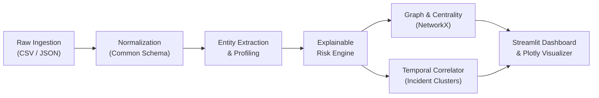

# DroidLens 🔍
### AI-Powered Criminal Network Analysis & Digital Forensics Triage System
**Smart India Hackathon (SIH 2026) | Problem Statement ID: 26189**  
**Organization:** Ministry of Home Affairs (MHA) | **Division:** NCRB / Women Safety Division  
**Category:** Software | **Theme:** Blockchain & Cybersecurity

---

## 📌 Project Overview
**DroidLens** is an explainable digital-forensics triage and criminal-network analysis prototype. Law enforcement investigators often deal with massive, fragmented forensic data (Call Detail Records, SMS logs, financial transactions, location pings, and surveillance reports). 

DroidLens transforms this fragmented data into a unified schema, detects anomalous and high-risk patterns using transparent rule-based heuristics, correlates multi-hop incident chains across space and time, constructs interactive network graphs, and presents actionable intelligence through an investigator-centric dashboard.

> [!IMPORTANT]
> **Decision-Support Notice:** DroidLens is designed strictly as an **investigative decision-support aid**, not an autonomous decision-maker. It surfaces observable patterns and connections to assist authorized analysts in prioritizing leads while maintaining full explainability.

---

## 🚀 Key Pipeline Architecture



### 1. Ingestion & Data Normalization
- Supports multi-format structured feeds (**CSV** and **JSON**).
- Normalizes disparate fields into a canonical `Event` schema: `timestamp`, `event_type`, `source`, `actor`, `target`, `location`, and `metadata`.

### 2. Explainable Suspicious-Activity Detection
- Computes bounded risk scores (**0–100**) paired with plain-language rationales.
- **Rule 1 — Communication Burst:** Flags high-frequency surges in calls/messages within short timeframes.
- **Rule 2 — High Connectivity:** Detects hub nodes communicating with an unusually high number of unique targets.
- **Rule 3 — Temporal Anomaly / Multi-Hop Relays:** Flags rapid sequential chains (e.g. $A \rightarrow B$ followed immediately by $B \rightarrow C$).
- **Rule 4 — Unusual Movement:** Flags impossible physical transit between distant geographic locations.
- **Rule 5 — High-Value Transactions:** Flags abnormal financial transfers exceeding risk thresholds.

### 3. Network Analysis & Correlation Engine
- **Graph Modeling:** Employs `NetworkX` to compute Degree Centrality, Betweenness Centrality, and interaction frequency.
- **Temporal Clustering:** Groups related events within a configurable sliding window (default: 30 minutes) into incident threads.
- **Investigation Timeline:** Generates a structured chronological activity narrative.

---

## 🛠️ Tech Stack
- **Language:** Python 3.10+
- **Data Processing:** `pandas`, `numpy`
- **Network Analysis:** `networkx`
- **Dashboard & UI:** `streamlit`, `plotly`
- **Testing:** `pytest`

---

## 📦 Installation & Setup

1. **Clone or Navigate to the Repository:**
   ```bash
   cd DroidLens
   ```

2. **Install Dependencies:**
   ```bash
   pip install -r requirements.txt
   ```

3. **Run Automated Test Suite:**
   ```bash
   pytest
   ```

4. **Launch Investigator Dashboard:**
   ```bash
   streamlit run dashboard/app.py
   ```

---

## 🔬 Demonstration Walkthrough
1. Launch the dashboard (`streamlit run dashboard/app.py`).
2. The built-in synthetic dataset (`data/raw/synthetic_investigation.csv`) loads automatically with planted patterns:
   - **Burst:** `Person_A` initiates rapid calls and messages to `Person_B` and `Person_C` between `14:00` and `14:40`.
   - **Hub:** `Person_B` acts as the central coordinator connected to 7 unique entities.
   - **Transaction Relay:** `Person_C` transfers Rs. 250,000 to `Person_D` at `14:22`, followed by a tower ping at `Noida` at `14:35`.
   - **Spatial Anomaly:** `Person_E` registers pings in `Delhi` at `15:00` and `Mumbai` at `15:15`.
3. Explore the **Network Graph**, inspect **Entity Dossiers**, review **Incident Clusters**, and download the **Investigation Dossier** (CSV/JSON).

---

## 👥 Hackathon Team Structure (6 Members)
- **P1 — Team Lead / Integration:** Architecture, repository management, coordination.
- **P2 — Data / Input Engineer:** Ingestion parsers, schema normalization, synthetic dataset design.
- **P3 — Detection Engineer:** Suspicious pattern rules, risk scoring, explainability reasons.
- **P4 — Correlation / Network Engineer:** Graph construction, centrality metrics, temporal correlator.
- **P5 — UI / Dashboard Engineer:** Streamlit layout, Plotly network visualizer, interactive filters.
- **P6 — QA / Documentation / Demo:** Test coverage, documentation, presentation rehearsal.

---

## 📄 License
Created for Smart India Hackathon (SIH) 2026. Educational and prototype demonstration use only.
